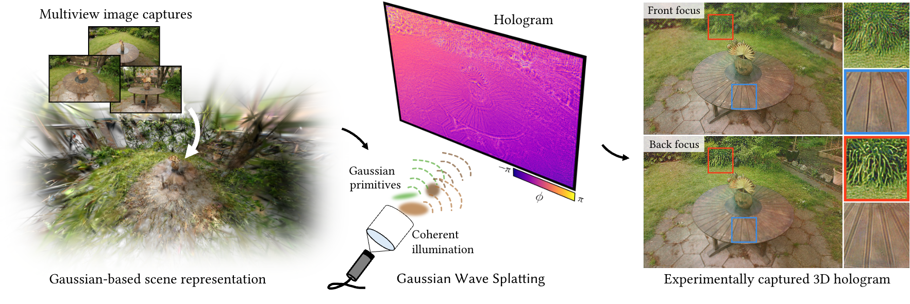

# hsplat

An open-source library for computer-generated holography using primitives.

## Associated paper
#### Gaussian wave splatting for computer-generated holography | SIGGRAPH 2025


[Project Page](https://bchao1.github.io/gaussian-wave-splatting/) | [Paper](https://dl.acm.org/doi/10.1145/3731163)

[Suyeon Choi*](https://choisuyeon.github.io/), [Brian Chao*](https://bchao1.github.io/), Jacqueline Yang, [Manu Gopakumar](https://manugopa.github.io/), [Gordon Wetzstein](https://web.stanford.edu/~gordonwz/)  
*denotes equal contribution

## Getting Started
Install PyTorch first, and then load the submodules in the `gsplat` folder with:
```
git submodule init
git submodule update
```

Download [Mip-NeRF 360](http://storage.googleapis.com/gresearch/refraw360/360_v2.zip) and [NeRF synthetic](https://drive.google.com/drive/folders/1cK3UDIJqKAAm7zyrxRYVFJ0BRMgrwhh4) dataset in ```hsplat/data``` folder.

Using `gsplat`, you can generate new scenes and store Gaussians in the ```hsplat/models``` folder, but we also provide pre-optimized Gaussians so that you can run the code out of the box. Download them from [here](https://drive.google.com/drive/folders/1zLCgHprvcwg1pDRiqiARcrXwHu4tWhAW?usp=drive_link) and place them in the ```hsplat/models``` folder.

## Overview
The code is organized as follows:
- The ```dsplat``` folder contains the phase encoding function (e.g., DPAC) for the SLMs, from the complex-valued wavefront output of ```hsplat```.
- The ```gsplat``` folder contains the [gsplat](https://github.com/nerfstudio-project/gsplat) library.
- The ```hsplat``` folder contains CGH algorithm implementations using primitives.

## Running the Code

To run our Gaussian Wave Splatting algorithm, run:
``` 
bash scripts/main_gws_light.sh
```

To run CGH algorithms for other primitives, run 
``` 
bash scripts/main_pc.sh  # point cloud
bash scripts/main_meshes.sh  # polygon-based CGH
bash scripts/main_gws.sh  # GWS matcinhg number of primitives
```

## Citation

If you find our work useful in your research, please cite:

```
@article{choi2025gaussian,
  title={Gaussian wave splatting for computer-generated holography},
  author={Choi, Suyeon and Chao, Brian and Yang, Jacqueline and Gopakumar, Manu and Wetzstein, Gordon},
  journal={ACM Transactions on Graphics (TOG)},
  volume={44},
  number={4},
  pages={1--13},
  year={2025},
  publisher={ACM New York, NY, USA}
}
```

## Contact

If you have any questions, please feel free to email [Suyeon Choi](https://choisuyeon.github.io/) and [Brian Chao](https://bchao1.github.io/).